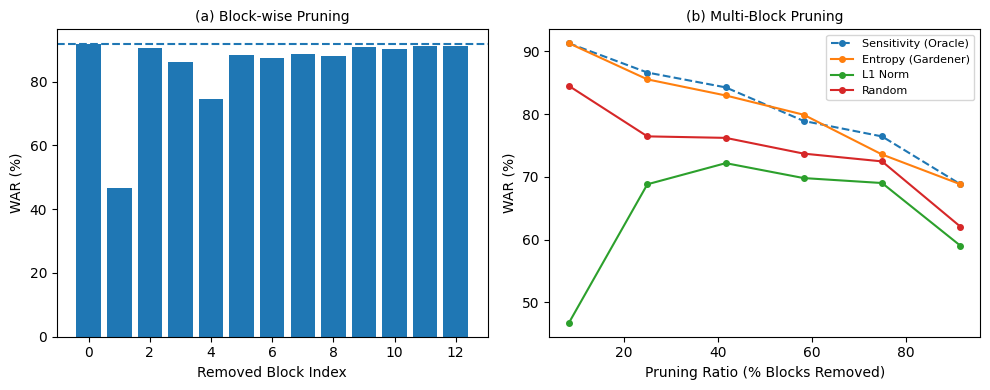
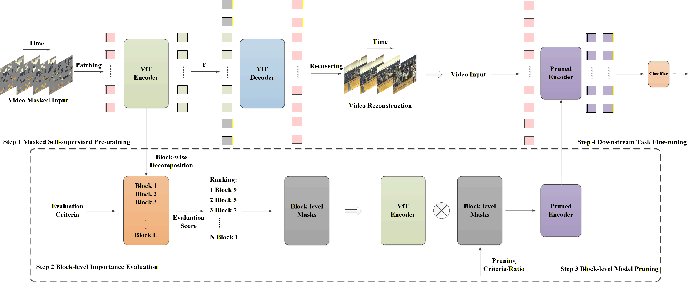
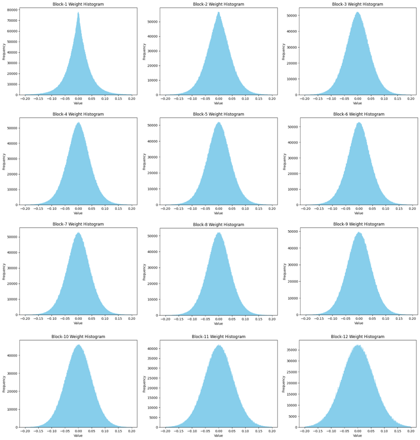
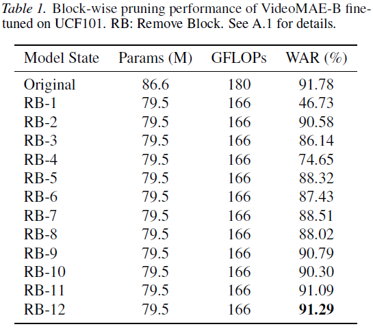
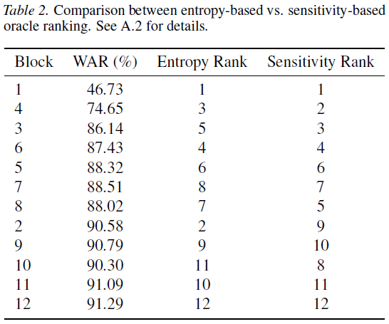
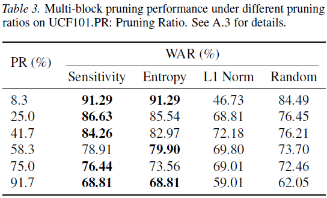
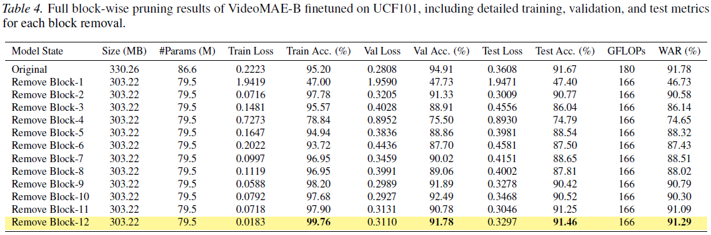
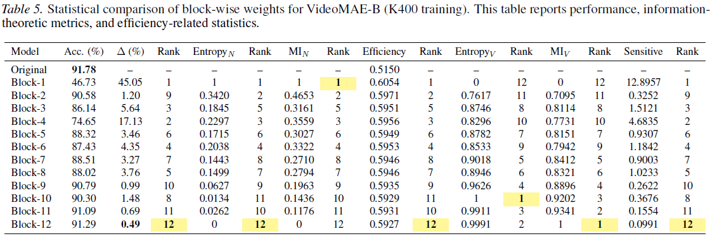
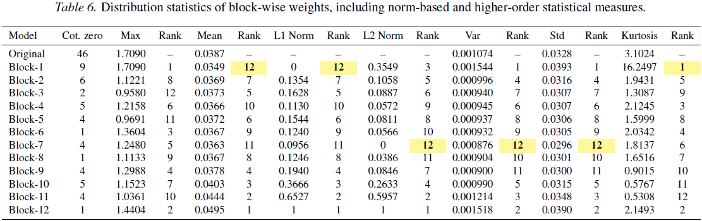
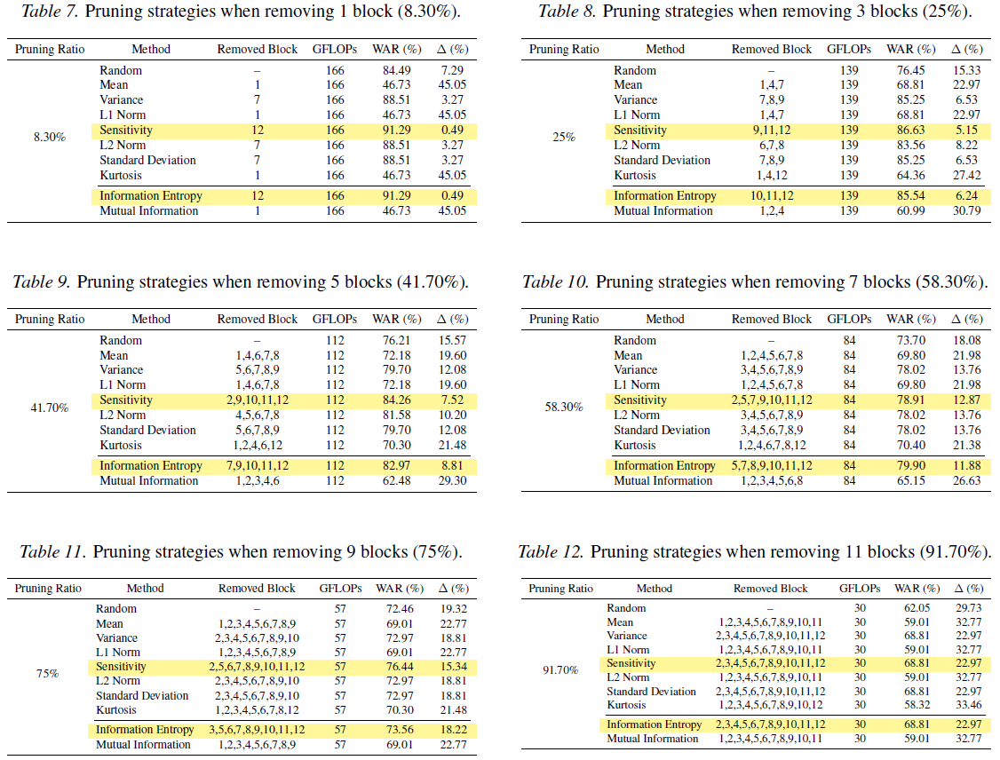

# Entropy Reveals Block Importance in Masked Self-Supervised Vision Transformers

> [](https://hcps.fiu.edu/) [](https://arxiv.org/abs/2602.03918) [](#citation) <br>
> [Peihao Xiang](https://Peihao-Xiang.github.io/), [Kaida Wu](https://scholar.google.com/citations?user=J0ojJOEAAAAJ), and [Ou Bai](https://scholar.google.com/citations?hl=zh-CN&user=S0j4DOoAAAAJ)<br>
> HCPS Laboratory, Department of Electrical and Computer Engineering, Florida International University<br>


[](https://colab.research.google.com/github/Peihao-Xiang/Gardener/blob/main/Gardener_Multi-Block%20Code/VideoMAE_B_K400_FT_UCF101_RM3B/VideoMAE_B_K400_FT_UCF101_HAR_Reduce%203%20Multi-Block_Entropy.ipynb)
[](https://huggingface.co/datasets/NoahMartinezXiang/UCF101)

Official TensorFlow implementation and Gardener Pruning codes for Entropy Reveals Block Importance in Masked Self-Supervised Vision Transformers.

Note: The .ipynb is just a simple example. In addition, the VideoMAE encoder model should be pre-trained using the Self-supervised method, but this repository does not provide it.

## Overview

Masked self-supervised vision transformers have become a dominant pretraining paradigm, yet their substantial model size poses significant challenges for resource-constrained deployment and efficient transfer learning. A fundamental question remains: are all transformer blocks equally important for downstream performance? In this paper, we show that block importance in masked self-supervised vision transformers can be accurately estimated without access to any data. Our key finding is that the information entropy of pretrained block weights strongly correlates with oracle sensitivity obtained via iterative block removal and finetuning. This observation enables Gardener, a data-free, one-shot, block-level pruning principle that identifies redundant blocks through simple information-theoretic measurements. We evaluate Gardener on VideoMAE-B across multiple pruning ratios and downstream video recognition benchmarks. Despite its negligible computational overhead, Gardener consistently matches or outperforms existing data-free pruning baselines and closely approaches sensitivity-based pruning. Remarkably, even after pruning up to 91.7\% of blocks, the pruned model retains competitive transfer performance. Our results reveal substantial block-level redundancy in masked self-supervised vision transformers and demonstrate that information-theoretic analysis offers a principled and efficient pathway for model compression and resource-efficient transfer learning.

<p align="center">
  <br>
</p>

Fig. 1 Pruning behavior of masked self-supervised vision transformers on VideoMAE-B finetuned on UCF101.

(a) Block-wise pruning results, where index 0 denotes the original model and indices 1–12 correspond to removing individual transformer blocks. The dashed line indicates the unpruned baseline. The results reveal substantial block-level heterogeneity. (b) Multi-block pruning performance under increasing pruning ratios. Entropy-based pruning (Gardener) consistently tracks sensitivity-based (oracle) pruning and outperforms other data-free criteria across a wide range of
pruning ratios.

## Implementation details

### Optimization Problem

$$\min_{M} \mathcal{L}(B_l \odot M; D) = \min_{M} \frac{1}{C} \sum_{i=1}^{C} \ell(B_l \odot M; D)$$

### Gardener Pipeline

<p align="center">
  <br>
</p>

Fig. 2 Architectural diagram of the information entropy-based Block-level Gardener pruning algorithm. Step 1: Visual self-supervised learning; Step 2: Calculating pruning criteria at the Block-level; Step 3: Pruning process of the VideoMAE Encoder Pretrained Model; Step 4: Fine-tuning the Pruned VideoMAE Encoder.

### Depth-Wise Entropy Pattern

<p align="center">
  <br>
</p>

Fig. 3 Weight distributions of transformer blocks at different depths in a pretrained VideoMAE encoder. Early blocks exhibit sharply peaked distributions, while deeper blocks show increasingly flatter and more dispersed parameter distributions.

## Main Results

### Block-Wise Pruning

<p align="left">
  <br>
</p>

### Entropy vs. Sensitivity Ranking

<p align="left">
  <br>
</p>

### Multi-Block Pruning

<p align="left">
  <br>
</p>

### Full Block-Wise Pruning

<p align="left">
  <br>
</p>

### Full Block-Wise Information Statistical

<p align="left">
  <br>
</p>

### Full Block-Wise Distribution Statistical

<p align="left">
  <br>
</p>

### Full Multi-Block Pruning

<p align="left">
  <br>
</p>

## Contact 

If you have any questions, please feel free to reach me out at pxian001@fiu.edu.

## Acknowledgments
This project is built upon [ImageMAE](https://github.com/facebookresearch/mae), [kerasMAE](https://keras.io/examples/vision/masked_image_modeling/) and [VideoMAE](https://github.com/innat/VideoMAE). Thanks for their great codebase.

## License

This project is under the Apache License 2.0. See [LICENSE](LICENSE) for details.

## Citation

If you find this repository helpful, please consider citing our work:

```BibTeX
@misc{xiang2026entropyrevealsblockimportance,
      title={Entropy Reveals Block Importance in Masked Self-Supervised Vision Transformers}, 
      author={Peihao Xiang and Kaida Wu and Ou Bai},
      year={2026},
      eprint={2602.03918},
      archivePrefix={arXiv},
      primaryClass={cs.CV},
      url={https://arxiv.org/abs/2602.03918}, 
}
```
